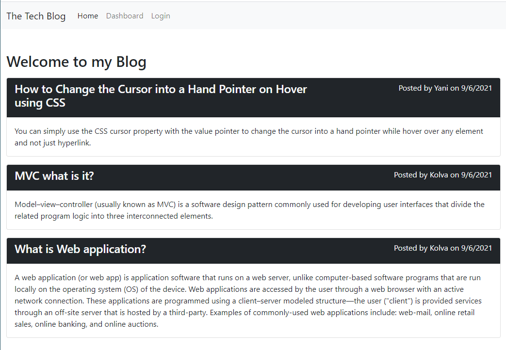
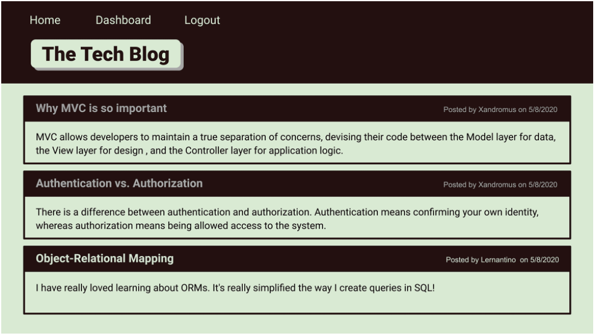

# Model-View-Controller (MVC): Tech Blog
Writing about tech can be just as important as making it. Developers spend plenty of time creating new applications and debugging existing codebases, but most developers also spend at least some of their time reading and writing about technical concepts, recent advancements, and new technologies. A simple Google search for any concept covered in this course returns thousands of think pieces and tutorials from developers of all skill levels!
## About

Here is a CMS-style blog site similar to a Wordpress site, where developers can publish their blog posts and comment on other developers’ posts as well. 

## User Story

```md
AS A developer who writes about tech
I WANT a CMS-style blog site
SO THAT I can publish articles, blog posts, and my thoughts and opinions
```
## Screenshots and mockups of the page

| |  | 
| --- | --- | 
|  Work done Home Page | Mockup Home Page| 
## What's included

This app follows the MVC paradigm  in its architectural structure, using Handlebars.js as the templating language, Sequelize as the ORM, and the express-session npm package for authentication.

- Technologies/Frameworks/Resources/Packages:
  - MySQL
  - express-handlebars
  - bcrypt 
  - Bootstrap

## Links to Review

* The URL of the functional, deployed application on Heroku: https://technical-blog-mvpie.herokuapp.com/

* The URL of the GitHub repository: https://github.com/MaryVPie/MVC-tech-blog

